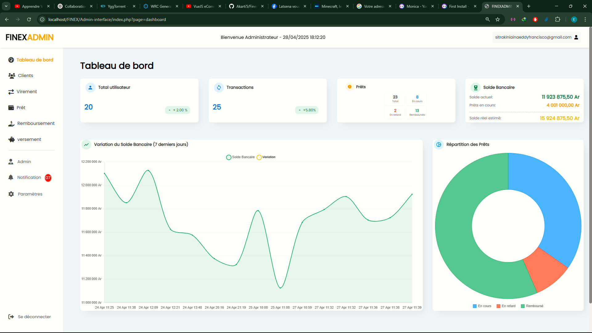

# FINEX - Système de Gestion Bancaire Simplifié



## Description du Projet

FINEX est un système de gestion bancaire en ligne conçu pour simplifier les opérations financières et administratives d'une institution bancaire. Il offre des fonctionnalités essentielles pour la gestion des clients, des comptes, des transactions (versements, virements), des prêts et des remboursements. L'objectif principal de FINEX est de fournir une plateforme intuitive et efficace pour le personnel bancaire, améliorant ainsi leur productivité et la qualité du service client.

Ce projet a été développé en utilisant PHP pour la logique back-end, HTML et CSS pour l'interface utilisateur, JavaScript pour l'interactivité et MySQL pour la gestion de la base de données.

## Fonctionnalités Clés

* **Gestion des Administrateurs :**
    * Authentification sécurisée des administrateurs.
    * Possibilité de créer, modifier et supprimer des comptes administrateurs.
* **Gestion des Clients :**
    * Enregistrement de nouveaux clients avec informations personnelles (nom, prénoms, contact, email, date d'adhésion).
    * Gestion des informations des clients existants (modification, suppression, statut).
    * Visualisation du solde des comptes clients.
* **Opérations Bancaires :**
    * **Versements :** Enregistrement des dépôts sur les comptes clients.
    * **Virements :** Transferts de fonds entre comptes clients.
    * Historique des transactions (versements et virements).
* **Gestion des Prêts :**
    * Enregistrement de nouvelles demandes de prêt (montant, date, durée, montant à rembourser).
    * Suivi de l'état des prêts (en cours, remboursé, en retard).
    * Gestion des remboursements de prêts (partiels, totaux).
    * Calcul automatique du montant à rembourser (incluant potentiellement des intérêts).
* **Historique Bancaire :**
    * Suivi de l'évolution du solde bancaire global.
    * Historique détaillé des soldes bancaires à différentes dates.
* **Interface Utilisateur Intuitive :**
    * Conception claire et facile à naviguer pour une expérience utilisateur optimale.
    * Utilisation de SweetAlert pour des notifications et des confirmations interactives.

## Technologies Utilisées

* **Back-end :** PHP
* **Front-end :** HTML, CSS, JavaScript
* **Base de Données :** MySQL
* **Bibliothèques/Frameworks :**
    * [Mentionner les bibliothèques JavaScript spécifiques utilisées, par exemple jQuery, etc.]
    * SweetAlert (pour les alertes interactives)
* **Outils de Développement :**
    * [Mentionner les outils comme phpMyAdmin, un IDE spécifique (VS Code, PhpStorm), etc.]

## Installation et Configuration

Pour exécuter FINEX sur votre environnement local, suivez ces étapes :

1.  **Prérequis :**
    * Un serveur web local (par exemple, Apache, Nginx).
    * PHP 7.4 ou version supérieure.
    * MySQL installé et configuré.
    * phpMyAdmin (facultatif, mais recommandé pour la gestion de la base de données).

2.  **Clonage du Répertoire :**
    ```bash
    git clone [https://github.com/Akarti5/FINEX.git](https://github.com/Akarti5/FINEX.git)
    cd FINEX
    code . [Pour l\'ouvrire dans un IDE ]
    ```

3.  **Configuration de la Base de Données :**
    * Créez une nouvelle base de données MySQL nommée `finex_db` (ou le nom que vous préférez).
    * Importez le fichier de structure de la base de données (`finex_db.sql`) dans votre base de données en utilisant phpMyAdmin ou la ligne de commande MySQL.
    ```bash
    mysql -u votre_utilisateur -p finex_db < finex_db.sql
    ```
    (Remplacez `votre_utilisateur` par votre nom d'utilisateur MySQL)

4.  **Configuration de la Connexion à la Base de Données :**
    * Localisez le fichier de configuration de la base de données (dans `config/db.php`).
    * Modifiez les informations de connexion (`$host`, `$user`, `$pass`, `$dbname`) avec les détails de votre serveur MySQL.
    ```php
    <?php
    $host = 'localhost'; // Ou l'adresse de votre serveur MySQL
    $user = 'root';
    $pass = ''; // vide
    $dbname = 'finex_db';
    ?>
    ```

5.  **Configuration du Serveur Web :**
    * Assurez-vous que le répertoire du projet `FINEX` est placé dans le répertoire racine de votre serveur web (par exemple, `htdocs` pour Apache, `www` pour Nginx).
    * Configurez votre serveur web pour accéder au projet via une URL (par exemple, `http://localhost/FINEX`).

6.  **Accès à l'Application :**
    * Ouvrez votre navigateur web et accédez à l'URL configurée pour le projet.
    * Vous devriez être en mesure de voir la page de connexion ou la page d'accueil de FINEX.

## Utilisation

Une fois l'installation réussie, vous pouvez vous connecter en tant qu'administrateur en utilisant les identifiants configurés dans la base de données (voir la table `administrateurs`). L'interface utilisateur vous permettra ensuite d'accéder aux différentes fonctionnalités de gestion des clients, des comptes et des transactions.

## Contribution

Les contributions au projet FINEX sont les bienvenues. Si vous souhaitez contribuer, veuillez suivre ces étapes :

1.  **Forkez le dépôt.**
2.  **Créez une nouvelle branche pour votre fonctionnalité ou correction de bug.**
3.  **Effectuez vos modifications et commitez-les.**
4.  **Poussez vos modifications vers votre fork.**
5.  **Soumettez une Pull Request décrivant vos changements.**

## Licence

Copyright (c) [2025] [SITRAKINIAINA Eddy Francisco]